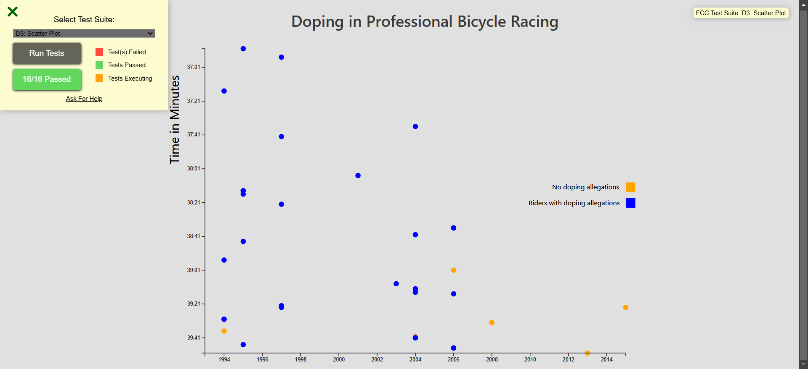

<div align="center">
  <a href="https://fcc-scatterplot-graph-cm.netlify.app/" target="_blanck"></a>
   <div>
    
    
    
</div>
  <h3 align="center">Visualize Data with a Scatterplot Graph</h3>
</div>

## <br /> 📋 <a name="table">Summary</a>

- ✨ [Introduction](#introduction)
- 🛠 [Technology Used](#tech-stack)
- 🚀 [Launch App](#launch-app)
- 🎨 [Styling](#style)


## <br /> <a name="introduction">✨ Introduction</a>

Second project FreeCodeCamp to valid the certification "Data Visualization"

**User Story :**

# Content

- User Story #1: I can see a title element that has a corresponding id="title". ✅

- User Story #2: I can see an x-axis that has a corresponding id="x-axis". ✅

- User Story #3: I can see a y-axis that has a corresponding id="y-axis". ✅

- User Story #4: I can see dots, that each have a class of dot, which represent the data being plotted. ✅

- User Story #5: Each dot should have the properties data-xvalue and data-yvalue containing their corresponding x and y values. ✅

- User Story #6: The data-xvalue and data-yvalue of each dot should be within the range of the actual data and in the correct data format. For data-xvalue, integers (full years) or Date objects are acceptable for test evaluation. For data-yvalue (minutes), use Date objects. ✅

- User Story #7: The data-xvalue and its corresponding dot should align with the corresponding point/value on the x-axis. ✅

- User Story #8: The data-yvalue and its corresponding dot should align with the corresponding point/value on the y-axis. ✅

- User Story #9: I can see multiple tick labels on the y-axis with %M:%S time format. ✅

- User Story #10: I can see multiple tick labels on the x-axis that show the year. ✅

- User Story #11: I can see that the range of the x-axis labels are within the range of the actual x-axis data. ✅

- User Story #12: I can see that the range of the y-axis labels are within the range of the actual y-axis data. ✅

- User Story #13: I can see a legend containing descriptive text that has id="legend". ✅

# TooltipTests

- User Story #14: I can mouse over an area and see a tooltip with a corresponding id="tooltip" which displays more information about the area. ✅

- User Story #15: My tooltip should have a data-year property that corresponds to the data-xvalue of the active area. ✅

# Dataset

> dataset to complete this project: https://raw.githubusercontent.com/freeCodeCamp/ProjectReferenceData/master/cyclist-data.json


## <br /> <a name="tech-stack">🛠 Technology Used</a>

- [TailwindCSS](https://tailwindcss.com/docs/installation)
  Tailwind CSS is a valuable tool for developers who want to build modern, responsive, and visually appealing websites without sacrificing development speed.

- [D3.js](https://www.npmjs.com/package/d3)
D3 (or D3.js) is a free, open-source JavaScript library for visualizing data. Its low-level approach built on web standards offers unparalleled flexibility in authoring dynamic, data-driven graphics.

## <br /> <a name="launch-app">🚀 Launch App</a>

Follow these steps to set up the project locally on your machine.

**Prerequisites**

> [!NOTE]
> Make sure you have the following installed on your machine:

- [Git](https://git-scm.com/)
- [Node.js](https://nodejs.org/en)
- [npm](https://www.npmjs.com/) _(Node Package Manager)_

**Cloning the Repository**

```bash
git clone {git remote URL}
cd {git project..}
```

**Installation**

> After cloning the repository, run the command `npm i` or `yarn i` to install the project's dependencies.

_npm_

```
npm install
```

_yarn_

```
yarn install
```

> Once the dependencies are installed, start the project with the command `npm run dev`.

## <br /> <a name="style">🎨 Styling</a>

Global styling are defined using **CSS** & **TailwindCSS**

<details>
<summary><code>index.css</code></summary>

```css
@tailwind base;
@tailwind components;
@tailwind utilities;

@layer base {
  body {
    @apply text-black-100 bg-white font-inter;
  }
  svg {
    @apply relative w-[900px] h-[630px];
  }
}

@layer utilities {
  .text {
    @apply text-2xl translate-x-8 translate-y-60 rotate-[-90deg];
  }

  #tooltip {
    @apply absolute p-[10px] text-xs rounded-lg text-left pointer-events-none opacity-0 bg-slate-300 text-black-200 border-none;
  }

  #legend {
    @apply flex flex-col translate-x-0 translate-y-[250px];
  }

  .legend-label {
    @apply flex;
  }

  .legend-rect {
    @apply w-4 h-4;
  }

  .legend-text {
    @apply text-black-200 text-xs translate-x-[690px] translate-y-[13px];
  }
}
```
</details>

<details>
<summary><code>tailwind.config.js</code></summary>

````cjs
theme: {
    extend: {
      colors:{
        white: '#ffffffde',
        black:{
          100: '#212121de',
          200: '#121212'
        }
      },
      fontFamily: {
        'inter': ['Inter', 'system-ui', 'sans-serif'],
      }
    },
  },
````

</details>